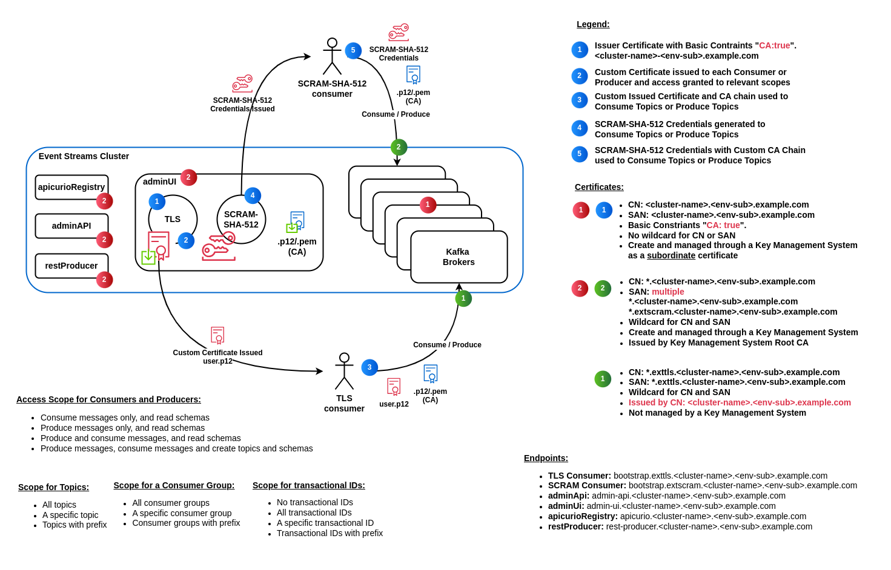

# Creating a Secure, Highly Available IBM Event Streams Cluster on OpenShift

## Introduction

IBM Event Streams is a robust, highly scalable messaging platform built on Apache Kafka, specifically optimized for OpenShift deployments. Enterprises running mission-critical workloads demand resilience, high performance, and stringent security, particularly when operating across multiple availability zones (AZs).

While deploying Event Streams securely might seem straightforward, key architectural decisions - such as the structure of subdomains and certificate management - can dramatically impact the ease of operations, scalability, and security posture. In this guide, I’ll share practical insights gained through experience, clearly highlighting why specific choices were made, such as wildcard subdomains and custom certificates from our internal Certificate Authority (CA) which were essential.

Specifically, you'll learn how these strategic decisions simplify endpoint management, ensure compliance with enterprise security policies, and significantly reduce operational overhead. The guide covers:

- Wildcard subdomains and their operational benefits.
- Leveraging custom-issued TLS certificates for improved security and trust.
- Step-by-step procedures for configuring IBM Event Streams securely on OpenShift.

Let's dive into these important considerations and practical implementation steps.

### Key Security and Operational Considerations
To ensure a secure, reliable, and easily maintainable IBM Event Streams deployment, certain strategic choices had to be made early on. Two critical decisions were the use of **wildcard subdomains** and **leveraging custom certificates issued by an internal trusted Certificate Authority (CA)** rather than the default or self-signed certificates.

#### Why Wildcard Subdomains?
IBM Event Streams, built upon Apache Kafka, dynamically generates and manages multiple service endpoints - such as Kafka brokers, Admin API, and consumer or producer endpoints. Each endpoint requires unique DNS entries and TLS certificates if managed individually, significantly increasing operational complexity and overhead.

Using wildcard subdomains addresses this complexity effectively by:

##### Simplifying DNS Management:
A wildcard DNS entry like ``*.es-prd.example.com`` covers all dynamically created endpoints, such as:

| Service           | Hostname                                               |
|-------------------|--------------------------------------------------------|
| TLS Consumer      | `bootstrap.exttls.<cluster-name>.es-prd.example.com`   |
| SCRAM Consumer    | `bootstrap.extscram.<cluster-name>.es-prd.example.com` |
| adminApi          | `admin-api.<cluster-name>.es-prd.example.com`          |
| adminUi           | `admin-ui.<cluster-name>.es-prd.example.com`           |
| apicurioRegistry  | `apicurio.<cluster-name>.es-prd.example.com`           |
| restProducer      | `rest-producer.<cluster-name>.es-prd.example.com`      |

Thus, there's no need for continuous DNS record updates each time an endpoint is added or removed.

##### Easier and Centralized Certificate Management:
Instead of generating and maintaining individual certificates for each endpoint, you manage a single wildcard TLS certificate (*.es-prd.example.com). This drastically reduces complexity, improves security posture (fewer certificates means fewer points of management and potential failure), and simplifies automated certificate renewal processes.

##### Scalability and Flexibility:
Wildcard certificates facilitate seamless scalability. Whether you're adding additional Kafka brokers or rebalancing workloads, your security and DNS setup won't become a bottleneck or operational risk.

##### Leveraging OpenShift Routes Effectively
Using wildcard subdomains enables you to fully leverage OpenShift Routes by associating meaningful, enterprise-specific domain names (*.es-prd.example.com) instead of default, auto-generated OpenShift hostnames. This approach provides clearer identification of services, improves the operational visibility of routes, and aligns route naming conventions directly with the organization's domain strategy. Additionally, using predictable and consistent domain names simplifies automation and reduces potential confusion or errors during deployments or troubleshooting.

In summary, wildcard subdomains and certificates provide scalability, operational simplicity, and enhanced maintainability—crucial for enterprise-grade Event Streams deployments.

#### Why use Custom Certificates Instead of Default or Self-Signed Certificates?
Default or self-signed certificates might be acceptable for small-scale or testing environments. However, enterprise-grade environments, especially those subject to strict compliance requirements, require more robust and trusted certificate management.

We chose custom certificates issued by our organization's internal Certificate Authtority which is managed by our internal Key Management System (KMS) due of several critical factors:

##### Using Wildcard Subdomains to Simplify Subject Alternative Names (SAN)
Wildcard subdomains significantly streamline certificate management by eliminating the need to frequently update Subject Alternative Names (SAN) on certificates. As Kafka brokers dynamically scale or new bootstrap endpoints are created, the wildcard certificate (*.es-prd.example.com) inherently covers all new endpoints. This approach prevents operational disruptions that typically occur when SAN entries need manual updates, ensuring uninterrupted scalability and simplifying certificate lifecycle management.

##### Compliance and Regulatory Requirements:
Enterprises are frequently subject to stringent security standards. Internally issued certificates from a trusted CA ensure we meet these compliance standards.

##### Established Trust Across Clients and Services:
Clients interacting with IBM Event Streams endpoints need a seamless trust establishment. Using certificates from a known internal CA ensures clients don't encounter security warnings or trust errors. This dramatically simplifies client onboarding and integration.

##### Centralized Management and Lifecycle Control:
Our internal KMS provides centralized control, automation, and oversight of the certificate lifecycle - including issuance, renewal, revocation, and auditing. Compared to platform-generated certificates, custom certificates allow us to integrate tightly with our existing security operations and tooling, reducing operational complexity.

##### Improved Security Posture:
Custom certificates reduce the risk of misconfiguration or inconsistent security practices. They're generated following our organization's approved cryptographic standards, policies, and controls - ensuring they adhere strictly to internal security best practices.

Without wildcard subdomains, each additional broker or endpoint would necessitate manual DNS entry creation and renewal of individual certificates - an error-prone and resource-intensive process.

### Certificate to secure HTTP endpoints and SCRAM-SHA-512 Authentication
The purpose of the first certificate is to secure all HTTP endpoints created by IBM Event Streams and also secure communication for KafkaUsers that are authenticated by SCRAM-SHA-512.

#### Common Name and Subject Alternative Names used are as follows:

- Common Name (CN): `*.<cluster-name>.<env-sub>.example.com`
- Subject Alternative Name (SAN):
    `*.<cluster-name>.<env-sub>.example.com` and 
    `*.extscram.<cluster-name>.<env-sub>.example.com`
  
This certificate is managed and issued by the organization's internal Key Management System Root Certificate Authority (CA) with wildcard values in the CN and SAN. 

### Issuer Certificate used by Event Streams to issue certificates for TLS
The certificate used to issue TLS certificates for to a KafkaUser whose  authentication method is TLS.

#### Common Name and Subject Alternative Names used are as follows:
- Common Name (CN): `<cluster-name>.<env-sub>.example.com`
- Subject Alternative Name: `<cluster-name>.<env-sub>.example.com`

This certificate is managed and issued as a subordinate certificate by the organization's internal Key Management System Root Certificate Authority (CA). No wildcard values are used in the CN and SAN. The Basic Constraints need to be "**CA:true**" as this certificate is required to issue subscriber a certificate.

### Certificate issued for TLS Authentication
This certificate is issued and signed by the previously described subordinate certificate [Certificate issued by Event Streams to a KafkaUser for TLS](#certificate-issued-by-event-streams-to-a-kafkauser-for-tls). 

#### Common Name and Subject Alternative Names used are as follows:
- Common Name (CN): `*.exttls.<cluster-name>.<env-sub>.example.com`
- Subject Alternative Name (SAN): `*.exttls.<cluster-name>.<env-sub>.example.com`

It specifically secures the external TLS endpoint used by Kafka clients connecting via TLS authentication. To ensure ease of management, this certificate utilizes wildcard values for both the Common Name (CN) and Subject Alternative Names (SAN), covering all dynamically generated endpoints associated with the TLS listener.

By explicitly configuring `spec.strimziOverrides.clientsCa.generateCertificateAuthority` and `spec.strimziOverrides.clusterCa.generateCertificateAuthority` to `false`, it ensures that IBM Event Streams does not generate self-signed certificates.

```yaml
spec:
  strimziOverrides:
    clientsCa:
      generateCertificateAuthority: false
    clusterCa:
      generateCertificateAuthority: false
```

## Certificate usage diagram
The following diagram illustrates how each certificate gets utilized.




## Creating dedicated Event Streams Worker nodes
Using OpenShift MachineSets, we provision dedicated worker nodes across multiple Availability Zones specifically tailored for IBM Event Streams workloads. These nodes are explicitly identified through consistent `taints` and `labels`, which correspond directly to the `affinity` rules and `tolerations` configured in the IBM Event Streams Custom Resource (CR). This setup ensures predictable workload scheduling, enhances isolation and security, and optimizes resource allocation for high-performance Kafka operations.

### MachineSet
```yaml
spec:
  metadata:
    labels:
        dedicated: eventstreams
  taints:
  - effect: NoSchedule
    key: dedicated
    value: eventstreams
```

### Configuring Affinity and Tolerations for Dedicated Worker Nodes on the IBM Event Streams CR
The following extract illustrates how to define the necessary affinity rules and tolerations within the IBM Event Streams Custom Resource (CR). These settings align explicitly with the previously configured dedicated worker nodes, ensuring workloads run exclusively on nodes designated for Event Streams. Properly matching these configurations guarantees optimal resource utilization, workload isolation, and operational stability.
```yaml
spec:
  strimziOverrides:
    kafka:
      template:
        pod:
          affinity:
            nodeAffinity:
              requiredDuringSchedulingIgnoredDuringExecution:
                nodeSelectorTerms:
                  - matchExpressions:
                      - key: dedicated
                        operator: In
                        values:
                          - eventstreams
          tolerations:
            - effect: NoSchedule
              key: dedicated
              operator: Equal
              value: eventstreams
    zookeeper:
      template:
        pod:
          affinity:
            nodeAffinity:
              requiredDuringSchedulingIgnoredDuringExecution:
                nodeSelectorTerms:
                  - matchExpressions:
                      - key: dedicated
                        operator: In
                        values:
                          - eventstreams
          tolerations:
            - effect: NoSchedule
              key: dedicated
              operator: Equal
              value: eventstreams
```

### MachineAutoscaler
To allow for autoscaling, OpenShift MachineAutoscaler were also created and applied to the cluster. 

```yaml
spec:
  maxReplicas: 3
  minReplicas: 1
  scaleTargetRef:
    apiVersion: machine.openshift.io/v1beta1
    kind: MachineSet
    name: <machine-set-name>
```

### Prerequisites for creating the IBM Event Streams cluster.

Before beginning, ensure you have the following:

- An OpenShift cluster that spans multiple availability zones.
- The IBM Cloud Pak for Integration entitlement key.
- The OpenShift CLI (`oc`) installed and configured to interact with your cluster.
- Certificate management tools such as OpenSSL.
- The IBM Event Streams Operator installed on your OpenShift cluster. 

## Important note

- All commands with regards to certificates and keys are case-sensitive, use as is to avoid confusion.

- The adminUI endpoint only supports TLSv1.2. All other endpoints support TLSv1.3.

- Update ConfigMap for Storage with custom taints: https://docs.redhat.com/en/documentation/red_hat_openshift_data_foundation/4.15/html/managing_and_allocating_storage_resources/managing-container-storage-interface-component-placements_rhodf#managing-container-storage-interface-component-placements_rhodf

### Create namespace for Event Streams Cluster
```oc new-project <cluster-name> --description="<<Event Streams Cluster Name>> - Production" --display-name="<<Event Streams Cluster Name>> - production"```

### Copy ibm-entitlement-key to the namespace
```oc get secret ibm-entitlement-key --namespace=ibm-common-services -o yaml | sed 's/namespace: ibm-common-services/namespace: <cluster-name>/g' | oc create -f -```

### Create the secret to secure HTTP endpoints and SCRAM-SHA-512 Authentication.
Refer to [Certificate to secure HTTP endpoints and SCRAM-SHA-512 Authentication](#certificate-to-secure-http-endpoints-and-scram-sha-512-authentication).

```oc -n <cluster-name> create secret generic <cluster-name>-es-prd-example-com --from-file=tls.key=_.<cluster-name>.es-prd.example.com-privkey.pem --from-file=tls.crt=_.<cluster-name>.es-prd.example.com.pem```

### Create CA secret
```oc -n <cluster-name> create secret generic <all-cluster-cas>-cluster-ca --from-file=ca.crt=CA.crt```
where `<all-cluster-cas>` is the prefix given to the secret that contains all CA certificates. Note, the `-cluster-ca` in the secret name cannot be changed or omitted.

### Create a Cluster and Client CA secret
For the certificate mentioned above in [Certificate issued by Event Streams to a KafkaUser for TLS](#certificate-issued-by-event-streams-to-a-kafkauser-for-tls), follow these steps:

- Use OpenSSL commands to extract the Certificate, Key and Root CA.
- Save the private key in a file called ```CA.key```.
- Save the subordinate certificate, its issuer and any other certificate including the Root CA in a file called ```CA.crt```.
- Create a copy of ```CA.crt``` and call it ```ca.pem```.

Follow the below steps carefully to configure the required Cluster and Client CA secrets.

#### Create JKS.
```keytool -import -file ca.pem -keystore ca.jks```

```keytool -importkeystore -srckeystore ca.jks -srcstoretype JKS -deststoretype PKCS12 -destkeystore ca.p12 -srcstorepass <<password>> -deststorepass <<password>>```

```keytool -list -keystore ca.p12 -storepass <<password>>```

#### Create Cluster CA secrets
**Note:** The secret name needs to follow the IBM Event Streams naming convention of <cluster-name>-cluster-*.

```kubectl create --namespace <cluster-name> secret generic <cluster-name>-cluster-ca --from-file=ca.key=CA.key```

```kubectl label --namespace <cluster-name> secret <cluster-name>-cluster-ca eventstreams.ibm.com/kind=Kafka eventstreams.ibm.com/cluster=<cluster-name>```

```kubectl annotate --namespace <cluster-name> secret <cluster-name>-cluster-ca eventstreams.ibm.com/ca-key-generation=0```
   
#### Create Cluster CA cert secret
**Note:** The secret name needs to follow the IBM Event Streams naming convention of <cluster-name>-cluster-*.

```kubectl create --namespace <cluster-name> secret generic <cluster-name>-cluster-ca-cert --from-file=ca.crt=CA.crt --from-file=ca.p12=CA.p12 --from-literal=ca.password='<<password>>'```

```kubectl label --namespace <cluster-name> secret <cluster-name>-cluster-ca-cert eventstreams.ibm.com/kind=Kafka eventstreams.ibm.com/cluster=<cluster-name>```

```kubectl annotate --namespace <cluster-name> secret <cluster-name>-cluster-ca-cert eventstreams.ibm.com/ca-cert-generation=0```

#### Create Client CA secrets
**Note:** The secret name needs to follow the IBM Event Streams naming convention of <cluster-name>-clients-*.

```kubectl create --namespace <cluster-name> secret generic <cluster-name>-clients-ca --from-file=ca.key=CA.key```

```kubectl label --namespace <cluster-name> secret <cluster-name>-clients-ca eventstreams.ibm.com/kind=Kafka eventstreams.ibm.com/cluster=<cluster-name>```

```kubectl annotate --namespace <cluster-name> secret <cluster-name>-clients-ca eventstreams.ibm.com/ca-key-generation=0```
   
#### Create Client CA cert secret
**Note:** The secret name needs to follow the IBM Event Streams naming convention of <cluster-name>-clients-*.

```kubectl create --namespace <cluster-name> secret generic <cluster-name>-clients-ca-cert --from-file=ca.crt=CA.crt --from-file=ca.p12=ca.p12 --from-literal=ca.password='<<password>>'```

```kubectl label --namespace <cluster-name> secret <cluster-name>-clients-ca-cert eventstreams.ibm.com/kind=Kafka eventstreams.ibm.com/cluster=<cluster-name>```

```kubectl annotate --namespace <cluster-name> secret <cluster-name>-clients-ca-cert eventstreams.ibm.com/ca-cert-generation=0```

#### Issue a new certificate signed by the subordinate certificate.
This is the certificate mentioned under [Certificate issued for TLS Authentication](#certificate-issued-for-tls-authentication).

Execute the shell script ```issue-custom-certificate.sh``` from the same location where the above certificates were created.
Example:

```sh
$ ./issue-custom-certificate.sh
Enter the Common Name (CN) for the certificate:
*.exttls.<cluster-name>.es-prd.example.com
Enter Subject Alternative Names (SAN), comma-separated (e.g., DNS.1=example.com,DNS.2=example.org):
DNS.1=*.exttls.<cluster-name>.es-prd.example.com
Ignoring -days; not generating a certificate
Generating a RSA private key
.....................+++++
........................................................................................+++++
writing new private key to '<<issued>>.key'
-----
Signature ok
subject=CN = *.exttls.<cluster-name>.es-prd.example.com
Getting CA Private Key
Certificate generated: <<issued>>.crt
```

### Create Listener secret to be used for listeners of ```type: tls``` 
```kubectl create secret generic exttls-listener --from-file=ca.key=<<issued>>.key --from-file=ca.crt=<<issued>>.crt```

### Create ClusterRole and ClusterRoleBinding required for rackawareness.
```oc apply -f clusterrole-eventstreams-kafka-broker.yaml```

```oc apply -f clusterrolebinding-eventstreams-kafka-broker.yaml```

### Create Config map
```oc -n <cluster-name> apply -f configmap-metrics-config-<cluster-name>.yaml```

### Create Eventstreams cluster
```oc -n <cluster-name> apply -f eventstreams-<cluster-name>.yaml```

### Enable Metrics
```oc -n <cluster-name> get serviceaccount | grep -i ibm-es-admapi```
```oc -n <cluster-name> adm policy add-cluster-role-to-user cluster-monitoring-view -z <cluster-name>-ibm-es-admapi```

## Conclusion

By following these steps, you have successfully installed and configured a fully secure IBM Event Streams deployment on OpenShift across multiple availability zones. The deployment includes strong encryption, proper certificate management, high availability, and robust monitoring capabilities. 

For additional details, refer to the [IBM Event Streams GitHub repository](https://github.com/IBM/ibm-event-automation/tree/main/event-streams).

